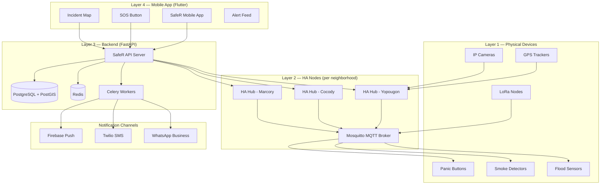

# SafeR CI — System Architecture

## Overview

SafeR CI is a 4-layer open-source safety platform:



---

## Component Details

### Home Assistant Nodes (Layer 2)

Each HA node is deployed as a **neighborhood safety hub** running on a Raspberry Pi 4:

| Component | Specification |
|-----------|--------------|
| Hardware | Raspberry Pi 4 (4GB RAM) |
| OS | Home Assistant OS (HAOS) |
| Power | Solar + LiFePO4 battery backup |
| Connectivity | 4G SIM (primary) + WiFi (secondary) |
| Protocols | Zigbee (XBT-2 dongle), MQTT, REST |
| Local DB | MariaDB (30-day incident history) |

**HA Add-ons installed:**
- Mosquitto MQTT Broker
- Node-RED (visual automation editor)
- MariaDB
- File Editor
- Terminal & SSH

### SafeR API Server (Layer 3)

**Technology:** FastAPI + Python 3.12 + PostgreSQL/PostGIS + Redis

**Key Endpoints:**
```
POST   /api/v1/incidents/          Create new incident
GET    /api/v1/incidents/          List incidents (geo-filtered)
GET    /api/v1/incidents/{id}      Get single incident
PATCH  /api/v1/incidents/{id}      Update status (responders)
POST   /api/v1/incidents/webhook/ha HA node webhook receiver
POST   /api/v1/alerts/broadcast    Send area-wide alert
GET    /api/v1/alerts/active       Get active alerts for location
POST   /api/v1/users/register      Register new user
POST   /api/v1/users/login         Authenticate user
```

### Mobile App (Layer 4)

**Technology:** Flutter 3.x + Riverpod + GoRouter

**Screens:**
- **SOS Screen** — Panic button + local emergency numbers (170, 180, 185)
- **Map Screen** — Live incident map (flutter_map + OpenStreetMap)
- **Alerts Screen** — Chronological alert feed for your area
- **Report Screen** — Community incident reporting with photo
- **Responder Screen** — For COGES/NGO agents: incident queue + assignment
- **Profile Screen** — Settings, notification preferences, emergency contacts

---

## Connectivity Fallback Strategy

```
Internet Available → REST API (HTTPS)
        ↓ fails
4G Available → MQTT over cellular
        ↓ fails  
2G Available → SMS via Twilio
        ↓ fails
Local Only → HA automation runs offline (siren, local log)
             Syncs to API when connectivity restored
```

---

## Security Architecture

- **JWT authentication** for all API endpoints
- **Hub webhook secret** — each HA node has a unique signed secret
- **HTTPS everywhere** — Nginx TLS termination
- **Rate limiting** — Redis-based, prevents alert flooding
- **Data locality** — All data stored in-country (VPS in West Africa region)
- **No PII in HA nodes** — Only sensor states, no personal data at the edge

---

## Deployment Topology

```
Internet
    │
    ▼
[Nginx Reverse Proxy + TLS]
    │
    ├── /api/v1/* → [FastAPI Container]
    │                      │
    │               [PostgreSQL + PostGIS]
    │               [Redis Cache]
    │               [Celery Workers]
    │
    └── HA nodes connect via MQTT WebSocket
             │
        [Mosquitto MQTT]
             │
        [HA Hub nodes] → Physical sensors
```

---

## Ivorian Context Adaptations

**Geographic coverage priorities:**
1. Grand Abidjan (Cocody, Yopougon, Marcory, Koumassi, Abobo) — highest density
2. Bouaké — second largest city
3. San Pedro — port city
4. Yamoussoukro — administrative capital
5. Rural communes via LoRaWAN

**Local emergency numbers integrated:**
- 170 — Police Nationale
- 180 — Sapeurs-Pompiers  
- 185 — SAMU
- 111 — Gendarmerie

**Language support:**
- French (primary UI language)
- Dioula (planned v1.1)
- SMS in French (Twilio template)
